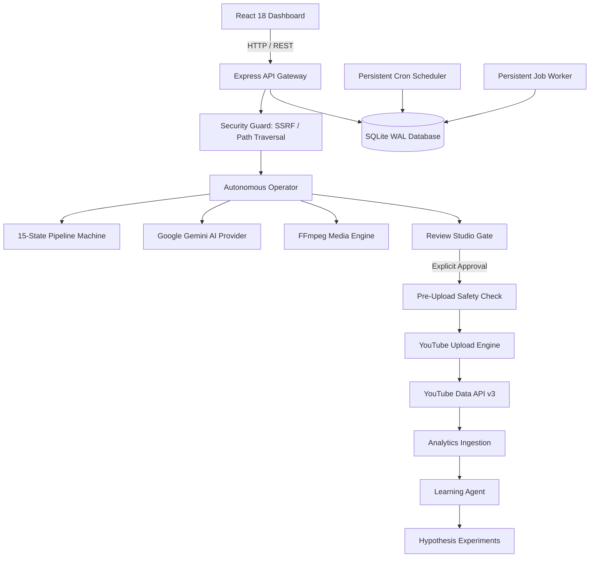

# ContentPilot AI — System Architecture

---

## 1. Core Architectural Pillars

1. **Deterministic 20-Stage Autonomous Flow**:
   - Every video project transitions through 20 deterministic operational checkpoints:
     `Inspect Channel` -> `Inspect Analytics` -> `Research` -> `Strategy` -> `Select Topic` -> `Script` -> `SEO` -> `Thumbnail` -> `Narration` -> `Visual Assets` -> `Video Assembly` -> `MP4 Integrity` -> `Quality Control (QC)` -> `Rights & Provenance` -> `Send to Review Studio` -> **`MANDATORY HUMAN APPROVAL GATE`** -> `YouTube Upload` -> `Capture Telemetry` -> `Learning` -> `Future Strategy`.
2. **Strict Human Governance Gate**:
   - Step 16 strictly halts autonomous execution until explicit approval is granted in Review Studio.
   - Pre-upload safety checker enforces 5 non-bypassable constraints.
3. **Resilient SQLite Persistence**:
   - All state transitions, jobs, and scheduled tasks are backed by SQLite running in Write-Ahead Logging (`WAL`) mode with foreign key integrity.
4. **Zero-Faking Policy**:
   - ContentPilot AI guarantees that metrics, video files, audio tracks, and citations reflect genuine system operations, never simulated placeholders.
5. **Auto-Fix Self-Healing**:
   - The engine automatically categorizes transient errors into 9 classifications and attempts safe recovery before escalating.
